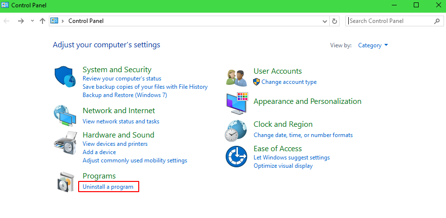
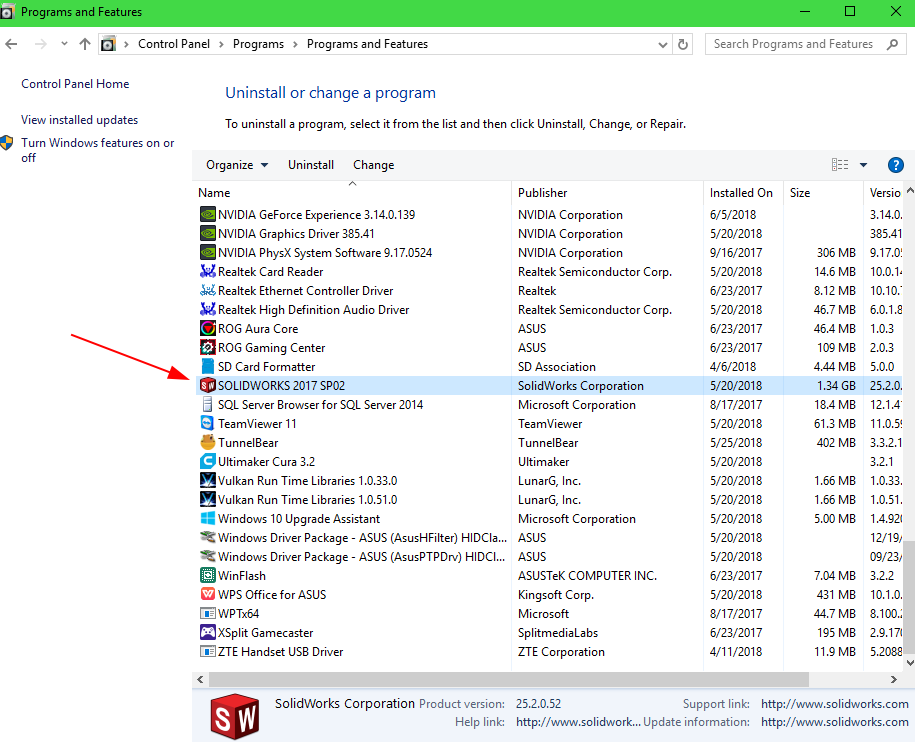
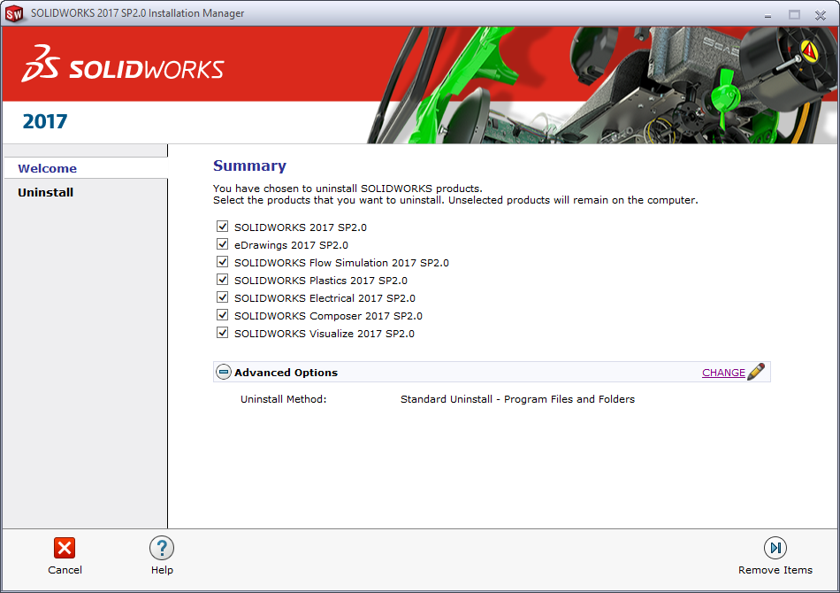
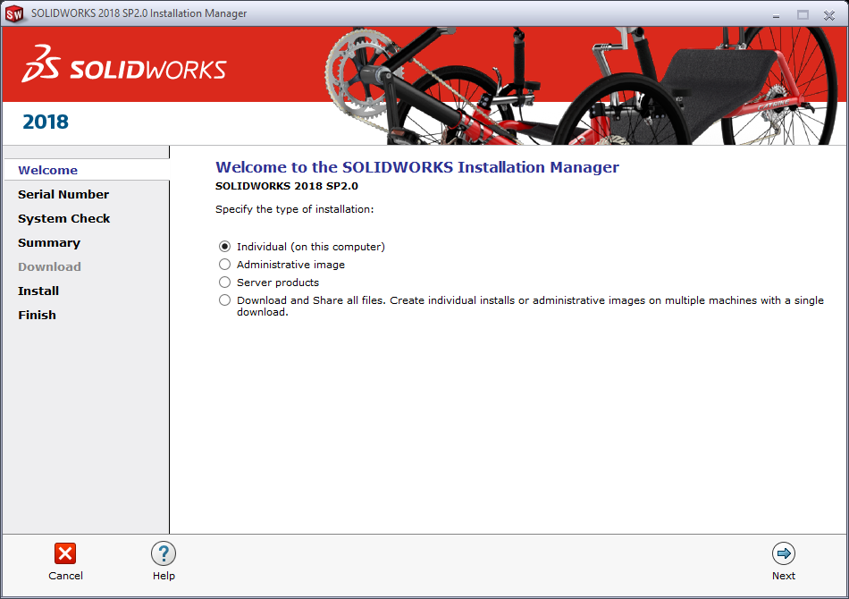
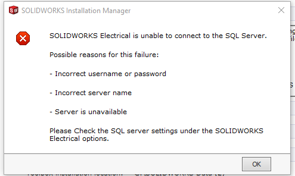

## 1. Uninstall SOLIDWORKS

*Note*: If you do not have a previous version of SOLIDWORKS installed on your computer, you may skip this part.

1. Open Windows Control Panel
2. Select “Uninstall A Program”

3. Locate and select SOLIDWORKS
4. Right-click and select “Uninstall”. The Solidworks Installation Manager will open.

5. Verify that the Uninstall Method is set as standard and all checkboxes are checked.
6. Click “Remove Items”

7. Click Yes to deactivate your licenses
8. Click Next. Your licenses will be deactivated.
9. Click Finish
10. The Installation Manager will begin uninstalling your installations. This may take a bit!
11. Once finished, click OK.
12. Restart your computer.

## 2. Install SOLIDWORKS

1. Open the document containing the current year’s licensure information. The 2018-2019 licensure information can be found [here](https://docs.google.com/spreadsheets/d/1PObqXnwpGlI1GgFQ8kdKpw1_LJsshfO7kX5fkcaNlS4/edit#gid=0).
2. Follow the instructions as listed in the document
3. After downloading, open the file. An extractor should open
   1. Click "Unzip"
   2. Click OK. The Installation Manager should launch

4. Specify “Individual (on this computer)” as the install type.

---

### Possible Error

If you get an error like this, follow the given steps. Otherwise, continue from step 5.

1. Click “CHANGE” on the Electrical Options. A new view will open
2. Append an “_1” to the end of the SQL Server Name
3. Select “Install a new instance of SQL Server”

4. Click “Back to Summary”

---

5.
